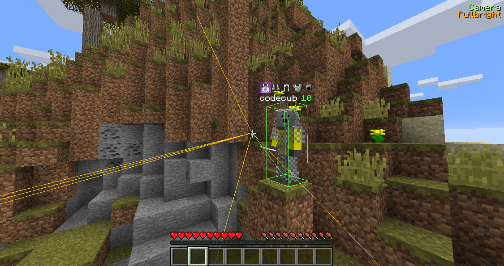
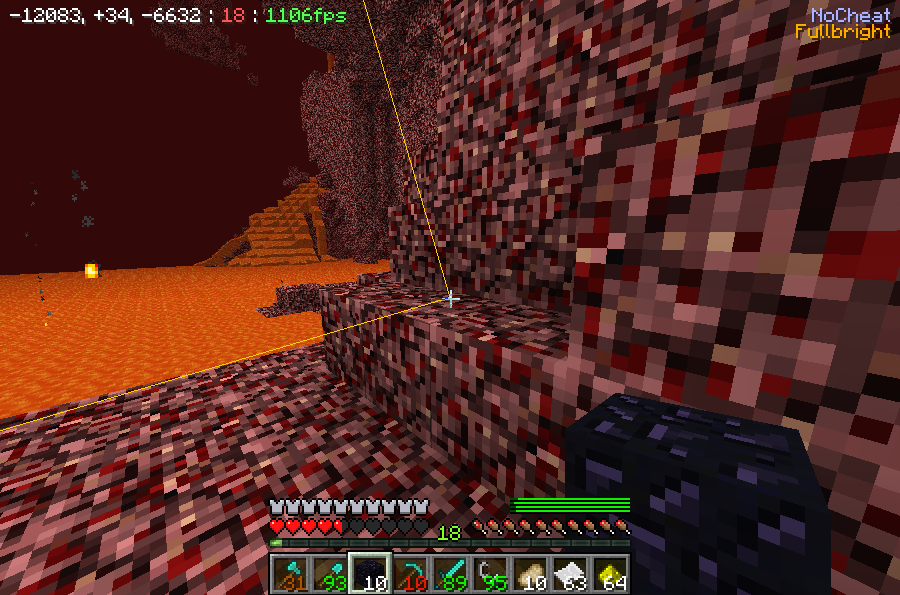

# CubClient

A repo for the codebase of my updated 1.10+ Minecraft client using **event handling**.

Currently supports 1.12.2.

To update from version to version see `patch.patch` which is a git diff of the changes made to the base Minecraft client (which are very few so that updating is as simple as copying over the `es/` directory) into `src`. 

# Why?

Because it takes me 10 minutes to update this where it used to take over 6 hours.

# Features/Usage

Everything in the client works in multiplayer.

- ArmorUI
    - fancy armor durability bar
- AutoFish (K)
    - away from keyboard fishing
    - works in camera mode
- Tool
    - silent tool switching within hotbar when hitting blocks (invisible to clientside)
    - "silent" behaviour achieved by sending a packet to switch the player's slot
    - also known as "auto tool"
- Disconnect (O)
    - disconnect if players are nearby or if you're about to die
    - use `-d distance` to set the desired range of players
    - ignores friends
- Sink (Z)
    - sink like a stone in water
- Antiaway from keyboard (N)
    - swing your arm so you don't disconnect every 60s
- Sprint (F)
    - easily toggle sprinting, no FOV switch
- AutoRun (H)
    - automatically run in a given direction, doesn't run you off cliffs or into lava
- Build (J)
    - copy and paste block models built in world within specified boundaries
    - load in models using `-load modelfile` and save them with `-save`.
    - use `-start` and `-end` to specify the boundaries of the model that is copied
    - automatically places blocks for you silently if you have them in your inventory (run around and build!)
    - probably the coolest thing in the entire client
- Coordinates (P)
- Dig (N)
    - auto digging with destroy count
- Turtle (M)
    - algorithmically dig out an entire region of ground (specified by the player)
    - use `-start` and `-end` to specify the boundaries of the quarried land
    - entirely away from keyboard
- NoCheat (`)
    - lets you avoid taking fall damage by automatically dispensing water beneath you
- PotionUI
    - shows off potion effects in the bottom right
- Reharvest
    - away from keyboard land farming using bonemeal (bot mode)
- Fullbright (C)
- Reconnect
    - automatically reconnect to a server upon disconnection at a given interval
- Sneak (R)
    - toggle sneak
- TraceESP
    - line tracing towards dropped items/players
- Wallhack (X)
    - fancy rendering of block meshes
    - track a block with `-w blockid`
    - clear all with `-clear`
- Camera (V)
    - step out of the player and clip through terrain to analyze the world
- Waypoint
    - set a visible waypoint using `-f x y z`
    - tracks distance
- Friends
    - make friends with others (serves as a filter)
- KillAura (G)
    - automatically attack entities nearby
    - doesn't attack friends
    - uses highest calculated damage
    - takes into account swing/power meter
    - use `-g distance` to set the effective range
- Item Nameplates
    - shows the items/armor other players are wearing above their nameplates

# Screenshots

